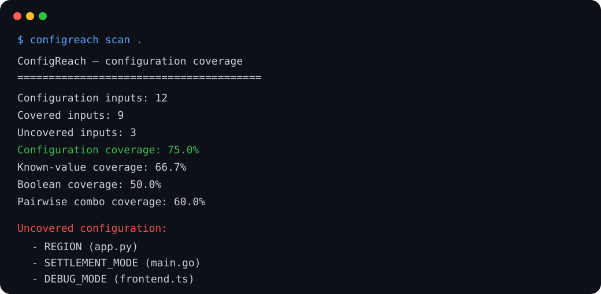

# ConfigReach

> **Your tests have 94% code coverage. But only 31% configuration coverage. ConfigReach tells you the difference.**

**ConfigReach is a deterministic, CPU-only, offline configuration coverage analyzer that shows which runtime configuration inputs, values, branches and important combinations your tests actually exercise.** Think **Codecov for configuration space**.

[](https://github.com/sauravsingla/ConfigReach/actions/workflows/ci.yml)
[](https://github.com/sauravsingla/ConfigReach/actions/workflows/codeql.yml)
[](LICENSE)
[](https://www.python.org/)
[](pyproject.toml)

ConfigReach needs **no GPU, no LLM, no API key, no hosted service, no telemetry and no paid dependency**. Static analysis does not execute the target repository. Machine-readable results are deterministic for the same repository state and configuration.



## Why configuration coverage?

Code coverage can tell you that a line executed. It cannot tell you whether the configuration states that change that line's behavior were exercised.

```python
mode = os.getenv("PAYMENT_MODE", "sandbox")
if mode == "live":
    charge_real_card()
else:
    simulate_charge()
```

A test suite can execute this code every time and still never exercise `PAYMENT_MODE=live`.

ConfigReach inventories configuration reads and declarations, maps them to test evidence, tracks known values and configuration-dependent branches, and reports missing keys, missing values, risky defaults, pairwise gaps and PR configuration deltas.

## Quick start

```bash
git clone https://github.com/sauravsingla/ConfigReach.git
cd ConfigReach
python -m pip install -e .
configreach scan .
```

Try the polyglot example:

```bash
configreach scan examples/polyglot
configreach explain PAYMENT_MODE examples/polyglot
configreach matrix examples/polyglot
configreach scan examples/polyglot --format html --output configreach.html
```

The combination fixture demonstrates why key coverage alone is insufficient:

```bash
configreach scan examples/combinations --no-cache
```

Its tests touch every discovered key and every individual known value, so key/value coverage can be 100%, while only **2 of 4 known pairwise value states** are exercised. ConfigReach reports that pairwise value-state coverage separately.

## Observable metrics — no opaque AI score

ConfigReach reports evidence-based metrics independently:

- **Key coverage** — discovered configuration inputs with detected test/runtime evidence.
- **Value coverage** — explicitly tested values / explicitly known values.
- **Boolean coverage** — tested `true`/`false` states where a boolean domain can be established.
- **Enum coverage** — exercised known discrete values for non-boolean finite domains.
- **Branch-state coverage** — known values used in configuration-dependent branches that have explicit test-value evidence.
- **Pairwise key coverage** — interacting keys read in the same dependency scope (Python function scope when available; file scope for conservative adapters) that receive joint test evidence.
- **Pairwise value-state coverage** — known value combinations for interacting keys observed together in the same detected test scenario.
- **Blast radius** — distinct files and top-level modules that read a configuration key.

Unknown domains remain unknown. ConfigReach never asks a model whether something is “probably covered.” See [docs/metrics.md](docs/metrics.md).

## Discovery coverage

### Runtime reads

| Ecosystem | Examples | Current analysis |
|---|---|---|
| Python | `os.getenv`, `os.environ[...]`, `os.environ.get`, `setdefault` | AST-backed |
| Pydantic Settings | `BaseSettings`, aliases, `Literal`, Enum, bool domains | AST-backed |
| Python CLI | `argparse`, common Click/Typer option forms | AST-backed/conservative |
| Feature flags | `is_enabled`, `feature_enabled`, LaunchDarkly-style `variation` | AST + conservative patterns |
| JavaScript / TypeScript | `process.env.KEY`, `process.env["KEY"]`, selected Deno/Bun forms | deterministic pattern adapter |
| Go | `os.Getenv`, `os.LookupEnv` | deterministic pattern adapter |
| Java | `System.getenv`, `System.getProperty` | deterministic pattern adapter |
| Rust | `env::var`, `env::var_os` | deterministic pattern adapter |
| Ruby | `ENV[...]`, `ENV.fetch(...)` | deterministic pattern adapter |
| PHP | `getenv(...)`, common `env(...)` | deterministic pattern adapter |
| Shell | `$VAR`, `${VAR}` | deterministic pattern adapter |

### Declarations and deployment sources

ConfigReach recognizes `.env.example`, `.env.template`, other `.env*` templates, JSON, TOML, INI/CFG, Java properties, YAML environment declarations, Dockerfiles/Containerfiles, Docker Compose environment blocks, Kubernetes-style environment declarations, Helm `values.yaml`, GitHub Actions `${{ vars.* }}` and `${{ secrets.* }}`, Terraform variables, Makefile variables, Pydantic settings fields and CLI options.

Python currently receives the deepest semantic treatment. Other ecosystems use conservative deterministic adapters and can be extended through the plugin SDK without adding runtime dependencies to the core.

## Commands

```bash
configreach scan [PATH]
configreach coverage [PATH]
configreach explain KEY [PATH]
configreach matrix [PATH]
configreach diff origin/main...HEAD [PATH]
configreach pr-comment origin/main...HEAD [PATH]
configreach doctor [PATH]
configreach export [PATH] --format json
configreach export [PATH] --format sarif
configreach export [PATH] --format html
configreach baseline create [PATH]
configreach cache clear [PATH]
configreach init [PATH]
configreach trace --path . -- pytest -q
```

## CI gating

```bash
configreach scan . --fail-under 70
configreach scan . --fail-on error
configreach scan . --fail-on uncovered
configreach scan . --fail-on untested-values
configreach scan . --fail-on default-only
configreach scan . --fail-on global-env-overwrite
```

`--fail-under` gates key coverage. `--fail-on` can gate finding aliases, severities or exact `CRxxx` rule IDs.

## Explain one configuration key

```bash
configreach explain PAYMENT_MODE .
```

The explanation includes reads, configuration-dependent branch locations, declarations, tests, known/tested values, validators, runtime observation, function provenance and blast radius.

## Pull-request configuration diff

```bash
configreach diff origin/main...HEAD
configreach pr-comment origin/main...HEAD --output /tmp/configreach-comment.md
```

ConfigReach resolves the local Git merge base, scans both the base snapshot and current tree, and reports:

- newly introduced configuration inputs,
- removed inputs,
- changed defaults/value/branch domains,
- newly introduced untested configuration,
- newly introduced values without test-value evidence,
- changed configuration files/modules and blast radius.

The analyzer uses only local Git data. It does not call GitHub or any external service. The optional workflow layer can post the generated Markdown as a PR comment.

## Searchable static HTML report

```bash
configreach scan . --format html --output configreach.html
```

The report is a single self-contained HTML file with no CDN or network dependency. It includes key/value/branch/combination metrics, a searchable configuration matrix, and links from configuration nodes to read, branch, declaration and test locations.

## Baselines

Adopt ConfigReach without failing new PRs on every historical gap:

```bash
configreach baseline create .
```

Baseline keys remain visible but are excluded from CI key-coverage gating. Newly discovered keys are never silently appended to the baseline. See [docs/baselines.md](docs/baselines.md).

## Persistent cache

Caching is enabled by default under `.configreach/cache/` and invalidates when eligible repository metadata or ConfigReach configuration changes.

```bash
configreach scan . --no-cache
configreach cache clear .
```

Cache/timing state is deliberately excluded from JSON/SARIF result semantics. Cache/report schemas are versioned so semantic-model changes invalidate stale cached data.

## Optional lightweight runtime tracing

```bash
configreach trace -- pytest -q
configreach scan .
```

Tracing is explicit opt-in. The Python tracer records configuration key names plus short SHA-256-derived value fingerprints to `.configreach/trace.jsonl`; it does not persist raw runtime values. Static analysis is fully usable without tracing.

## Deterministic findings

| Rule | Meaning | Default severity |
|---|---|---|
| `CR001` | discovered configuration has no detected test/runtime evidence | warning |
| `CR002` | configuration read by application code but not declared in a recognized source | warning |
| `CR003` | configuration declared but not read by recognized application code | note |
| `CR004` | known configuration values are not all exercised | warning |
| `CR005` | sensitive-looking configuration has a non-empty static default | error |
| `CR006` | likely inconsistent names normalize to the same identifier | warning |
| `CR007` | production-like known value (`live`, `prod`, etc.) is not exercised | warning |
| `CR008` | explicit test values only exercise defaults while known alternatives exist | warning |
| `CR009` | a test mutates the global environment in a way that may leak configuration state | warning |

These are deterministic heuristics, not semantic certainty claims. Every finding retains source provenance.

## GitHub Actions

```yaml
name: Configuration coverage
on: [pull_request]

jobs:
  configreach:
    runs-on: ubuntu-latest
    steps:
      - uses: actions/checkout@v4
        with:
          fetch-depth: 0
      - uses: sauravsingla/ConfigReach@main
        with:
          path: .
          format: markdown
          fail-under: "60"
          fail-on: error
```

Markdown output is appended to the GitHub job summary. SARIF can be uploaded with GitHub Code Scanning. An optional PR-comment workflow is included at [`.github/workflows/configreach-pr.yml`](.github/workflows/configreach-pr.yml).

## Configuration

Create a starter configuration:

```bash
configreach init
```

```toml
[configreach]
fail_under = 60
fail_on = ["error"]
ignore = ["vendor/**", "generated/**"]
test_patterns = ["tests/**", "**/test_*.py", "**/*.spec.ts"]
baseline = ".configreach/baseline.json"
trace_file = ".configreach/trace.jsonl"
cache = true
plugins = true
```

## Monorepos

ConfigReach detects package roots from Python, Node, Go, Rust, Maven and Gradle manifests and exposes them in reports. Paths remain repository-relative. Deeper workspace-local incremental invalidation is on the roadmap.

## Plugin SDK

Third-party packages can register deterministic adapters through the `configreach.adapters` Python entry-point group. Plugin failures are isolated as scanner warnings rather than crashing the scan. See [docs/plugin-sdk.md](docs/plugin-sdk.md).

## Benchmark

```bash
python benchmarks/bench_scan.py 1000
```

The benchmark creates a temporary synthetic repository and measures a cold CPU scan. Results are environment-dependent and intentionally not treated as a quality score.

## Testing

```bash
python -m pip install -e ".[dev]"
pytest
python -m compileall -q src tests
```

The suite covers Python AST discovery, multi-language reads, deployment/config sources, Pydantic settings, `Literal`/Enum/bool domains, feature flags, branch provenance, function-scoped dependency analysis, key-pair and value-pair metrics, real two-commit Git PR comparison, baselines, cache round-trips, HTML/SARIF/JSON/Markdown reporters, structured sensitive defaults, deterministic generated inventories and CLI policy behavior.

## Design principles

- CPU-only and zero runtime dependencies.
- No network, telemetry, model inference or paid API in the core.
- Static scanning never executes target application code.
- Runtime tracing is explicit opt-in.
- Sensitive values are redacted before report serialization.
- Unknown is preferable to fabricated certainty.
- Every finding has inspectable source provenance.
- Machine-readable result semantics are reproducible.

See [architecture](docs/architecture.md), [metrics](docs/metrics.md), [threat model](docs/threat-model.md), [plugin SDK](docs/plugin-sdk.md) and [roadmap](docs/roadmap.md).

## Contributing

Contributions are welcome, especially small reproducible fixtures for language/framework-specific configuration idioms. See [CONTRIBUTING.md](CONTRIBUTING.md).

## Security and privacy

Static analysis is local, deterministic and network-free. ConfigReach is not a credential validator or replacement for a dedicated secret scanner. See [SECURITY.md](SECURITY.md) and [docs/threat-model.md](docs/threat-model.md).

## License

MIT — see [LICENSE](LICENSE).
